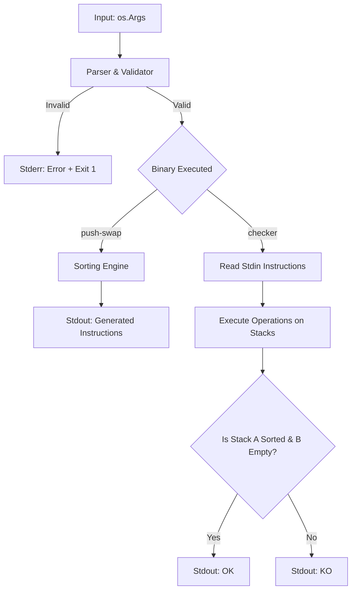

# Product Requirements Document (PRD) - push-swap

## 1. Problem Statement

**Context:**  
We need two Go CLI applications: a sorting algorithm calculator (`push-swap`) and a validation tool (`checker`). The project relies on sorting a list of integers using two stacks (`a` and `b`) and a highly restricted set of operations (push, swap, rotate, reverse rotate).

**Core Function:**
1. **`push-swap`**: Receives a list of integers as arguments and outputs the shortest possible sequence of formatting instructions to sort the stack in ascending order.
2. **`checker`**: Receives the same list of integers as arguments, reads the generated instructions from standard input, applies them to the stacks, and outputs whether the final state is successfully sorted (`OK`) or not (`KO`).

**Constraints:**  
- Must be written in Go (Target version: 1.25.6+).
- Must use the Go Standard Library **only** (no third-party packages).
- Strict execution benchmarks: e.g., < 12 instructions for 5 numbers, < 700 instructions for 100 numbers.
- Strict error formatting: Must print exactly `Error\n` to `stderr` on any validation failure.

---

## 2. Target User & Use Case

- **Primary User:** Terminal users, system auditors, and automated benchmark scripts.
- **Use Case:** A user provides a randomized sequence of unique integers to the `push-swap` program. The program computes an optimized path to sort these integers using stack operations and prints them. The user then pipes these operations into the `checker` program (along with the same initial sequence) to instantly verify if the sorting logic is mathematically sound.

---

## 3. System Contract

### 3.1 CLI Contract

**Program 1: `push-swap`**
- **Command:** `./push-swap "2 1 3 6 5 8"` (or multiple arguments like `./push-swap 2 1 3 6 5 8`)
- **Input:**
  - **`[Arguments]`:** Optional, integers formatted as a single string or multiple string arguments. Represents stack `a`.
- **Output:** A sequence of valid stack operations (e.g., `sa`, `pb`, `ra`), each followed by a newline (`\n`), printed to `stdout`.

**Program 2: `checker`**
- **Command:** `echo -e "sa\npb\nrrr\n" | ./checker "2 1 3 6 5 8"`
- **Input:**
  - **`[Arguments]`:** Optional, integers representing the initial state of stack `a`.
  - **`[Standard Input - stdin]`:** A stream of stack operations, each separated by `\n`.
- **Output:** 
  - `OK\n` to `stdout` if stack `a` is sorted and stack `b` is empty.
  - `KO\n` to `stdout` if stack `a` is not sorted or stack `b` is not empty.

### 3.2 Error Handling Expectations

- **Missing Input (No Arguments):** If executed with 0 arguments, both programs must display absolutely nothing and exit gracefully.
- **Invalid Input (Arguments):** If arguments contain duplicates, non-integers, or exceed integer limits, immediately terminate and print `Error\n` to `stderr`. Empty strings (`""` or `"   "`) are treated as invalid inputs.
- **Invalid Input (Instructions):** If the `checker` receives an unknown or incorrectly formatted instruction via `stdin`, immediately terminate and print `Error\n` to `stderr`.
- **Edge Cases:** Safe handling of `MaxInt`/`MinInt`, pre-sorted lists (do nothing), and gracefully exiting without panic on EOF or empty instruction streams.

---

## 4. Functional Requirements (Rules)

### 4.1 Data & Resource Management
- **Input Parsing:** The system must parse single strings (e.g., `"1 2 3"`) and multiple string arguments (e.g., `"1" "2" "3"`) into a structured Go integer slice.
- **State Management:** Two independent stack structures (`a` and `b`) must be maintained in memory to track the sequence of numbers during instruction execution.

### 4.2 Core Logic & Processing
- **Instruction Set:** Implementation of 11 distinct operations:
  - Swap: `sa`, `sb`, `ss`
  - Push: `pa`, `pb`
  - Rotate: `ra`, `rb`, `rr`
  - Reverse Rotate: `rra`, `rrb`, `rrr`
- **push-swap Engine:** Employs an optimized non-comparative or chunk-based sorting algorithm (such as Radix Sort, or custom small-sort heuristics) to emit the absolute minimum number of valid instructions.
- **checker Engine:** Reads a sequential stream of operations from standard input, strictly applying them to the internal stack state. Verifies if stack `a` is purely ascending and stack `b` is empty.

### 4.3 Error Handling Philosophy
The program follows a **fail-fast** strategy.
- **Validation Failure:** Immediately terminate execution by returning exit code `1` (e.g., `os.Exit(1)`) upon detecting bad inputs or invalid commands.
- **Output Constraint:** Print exactly `Error\n` on `stderr`.
- **Internal Integrity:** No raw Go panics (like "index out of range") should ever reach the user.

---

## 5. Non-Goals (Out of Scope)

- No external dependencies; standard Go library **only**.
- No graphical user interface (GUI) or web API; this is strictly a terminal-based CLI tool.
- No database persistence or file storage; all states are managed entirely in memory during execution.
- No support for floating-point numbers or non-numeric strings; the domain is strictly bounded to integers.
- No heavy memory caching or pre-computed lookup tables; state management should be strictly limited to the necessary slice/stack data structures.
- No concurrent sorting algorithms; the execution and instruction generation must be strictly sequential to ensure deterministic outputs.
- No dynamic or continuous input streams for the stack data; the initial stack state is strictly fixed at startup via arguments, and the programs do not act as interactive REPLs.
- No external configuration files (e.g., .env, .json, .yaml); the program behavior must be completely defined by its core logic and runtime arguments.
- No excessive memory consumption; algorithms must scale with reasonable space complexity (e.g., O(N)), avoiding unbounded state trees or massive allocations during search routines.

---

## 6. Acceptance Criteria & Testing Suite

*To satisfy the Definition of Done (DoD), the project must pass the modular testing suite. Detailed case execution is delegated to the specific test documents provided in `.docs/` directory, such as `golden-tests.md`*.

### 6.1 Core Functionality & Audit Cases
- [x] **Audit Case C02**: Valid Sorting | 
**Input Argument**: `./push-swap "2 1 3 6 5 8"` | **Expected Behavior/Output**: Valid solution & less than 9 instructions.
- [x] **Audit Case C06**: Benchmark: 5 Random Nums | **Input Argument**: `./push-swap "<5 random numbers>"` | **Expected Behavior/Output**: Valid solution & less than 12 instructions.
- [ ] **Audit Case C09**: Incorrect Instructions | **Input Argument**: `echo -e "sa\npb\nrrr\n" \| ./checker "0 9 1 8 2 7 3 6 4 5"` | **Expected Behavior/Output**: `KO\n` on standard output.
- [ ] **Audit Case C10**: Correct Instructions | **Input Argument**: `echo -e "pb\nra\npb\nra\nsa\nra\npa\npa\n" \| ./checker "0 9 1 8 2"` | **Expected Behavior/Output**: `OK\n` on standard output.
- [x] **Audit Case C12**: Benchmark: 100 Random Nums | **Input Argument**: `ARG="<100 random numbers>"; ./push-swap "$ARG"` | **Expected Behavior/Output**: Valid solution & less than 700 instructions.

### 6.2 Error & Validation Cases
- [ ] **Error Case E01**: Non-integer argument | **Input Argument**: `./push-swap "0 one 2 3"` | **Expected Behavior/Output**: `Error\n` on stderr.
- [ ] **Error Case E02**: Duplicate integer | **Input Argument**: `./push-swap "1 2 2 3"` | **Expected Behavior/Output**: `Error\n` on stderr.
- [ ] **Error Case E03**: Integer overflow/underflow | **Input Argument**: `./push-swap "2147483648"` | **Expected Behavior/Output**: `Error\n` on stderr.
- [ ] **Error Case E04**: Invalid instruction | **Input Argument**: `echo -e "sa\nbadcmd\n" \| ./checker "1 2 3"` | **Expected Behavior/Output**: `Error\n` on stderr.
- [ ] **Error Case E05**: Incorrectly formatted instruction | **Input Argument**: `echo -e "sa \n" \| ./checker "1 2 3"` | **Expected Behavior/Output**: `Error\n` on stderr.

### 6.3 Edge & Boundary Cases
- [ ] **Edge Case EC01**: Empty or Whitespace String | **Input Argument**: `./push-swap ""` / `"   "` | **Expected Behavior/Output**: `Error\n` on stderr. (Fails integer parsing).
- [x] **Edge Case EC02**: Single Number | **Input Argument**: `./push-swap "42"` | **Expected Behavior/Output**: Displays nothing (already sorted).
- [x] **Edge Case EC03**: Already Sorted | **Input Argument**: `./push-swap "1 2 3 4"` | **Expected Behavior/Output**: Displays nothing (0 instructions).
- [x] **Edge Case EC04**: Max/Min Int bounds | **Input Argument**: `./push-swap "2147483647 -2147483648 0"` | **Expected Behavior/Output**: Parsed correctly and outputs valid sorting instructions.
- [x] **Edge Case EC05**: Massive Stack | **Input Argument**: `./push-swap "<500 random numbers>"` | **Expected Behavior/Output**: Executes quickly without memory leaks.

---

## 7. Implementation Approach (Architecture)

### 7.1 Architectural Overview
The project follows a **Modular CLI Pipeline** architecture. Because there are two separate executables (`push-swap` and `checker`) that share 90% of their logic, almost all code will live in a shared `/internal` directory.
- **Pattern:** Shared Core Library (`/internal`) with distinct execution entry points (`/cmd`).
- **Reasoning:** Prevents code duplication, ensures both binaries use the exact same validation and instruction rules, and isolates the core logic for easier unit testing.
- **Tradeoffs & Strategy:** We prioritize execution speed for massive stacks (500 items). We will use **Zero-Value usable** structures and trade memory (pre-allocating slice capacities based on argument count) to avoid reallocation during rapid sorting operations.

---

### 7.2 System Flowchart

### 7.3 Module Responsibilities
1. **Entry Points (`cmd/`)**: Minimal orchestration logic for `push-swap` and `checker` binaries.
2. **Input Layer (`internal/parser/`)**: Handles argument sanitization, whitespace handling, and duplicate detection.
3. **Error Handling (`internal/errs/`)**: Centralized package for the mandatory `Error\n` signal and `os.Exit(1)` management.
4. **Domain Model (`internal/stack/`, `internal/operations/`)**: Manages `a` and `b` state. Implements the 11 atomic mutations.
5. **Sorting Engine (`internal/sorter/`)**: Three-file engine — `dispatcher.go` (routing + rank normalisation), `hardcoded.go` (BFS-optimal tables for n=2..5), `chunk.go` (Butterfly sliding-window for n>5).
6. **Output Layer**: Shared logic for printing valid instructions or evaluation results (`OK`/`KO`).

---

## 8. Milestones & Roadmap

- **Milestone 1: Foundation** - Skeleton setup, `testdata/` scaffolding, strict input parsing, and high-performance Stack structures.
- **Milestone 2: Operations & Checker** - Implementing the 11 strict operations (`sa`, `pb`, etc.) and fully building the `checker` to serve as our internal testing oracle.
- **Milestone 3: Base Sorting Logic** - Implementing hard-coded, BFS-optimal sorts for small sets (n=2..5) to comfortably pass the `<12 instructions` benchmark. n=6 falls through to the chunk algorithm (no strict op limit).
- **Milestone 4: Advanced Algorithm Integration** - Implementing the primary scalable sorting algorithm (e.g., Radix Sort, Chunk Sort, or Longest Increasing Subsequence) to handle 100/500 numbers within benchmark limits.
- **Milestone 5: QA & Integration** - Running the Golden Test suite, performance optimization, and memory leak/race checks.

---

## 9. Risks & Open Questions

### 9.1 Risk Assessment

| Risk | Impact | Mitigation Strategy |
|---|---|---|
| **Algorithm Inefficiency** (Failing 700 ops for 100 nums) | High | Implement a proven chunking or Radix approach early; run automated benchmarks frequently via standard shell scripts. |
| **Memory Leaks / Panics** | High | Use strict bounds checking before applying `pop`/`push`. Run `go test -race` and `go vet` extensively. |
| **Empty/Whitespace Parsing** (`""` or `"  "`) | Medium | Ensure the parser sanitizes and rejects these explicitly as non-integers per `EC01`. |

### 9.2 Open Questions

- **Question:** Which advanced sorting algorithm guarantees the lowest instruction count for exactly 100 numbers?
  - *Decision:* To be determined during Milestone 4 benchmarking. Radix sort is easiest to implement with two stacks, but a custom chunk-based sort or LIS (Longest Increasing Subsequence) often yields fewer operations.
